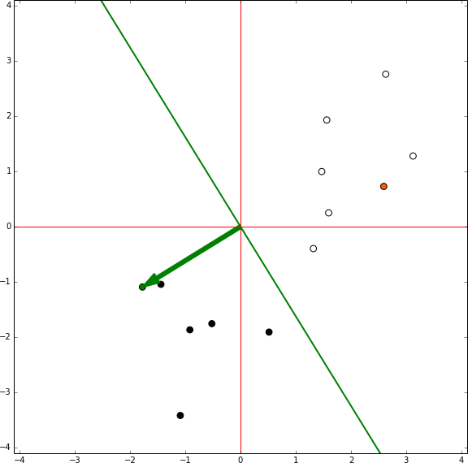

ann_notebooks
=============

Tutorial of different Artificial Neural Networks using the platform IPython Notebook (http://ipython.org/notebook.html)

## Perceptron

The following is an example of the training process of a Perceptron without bias component that is generated in the tutorial

